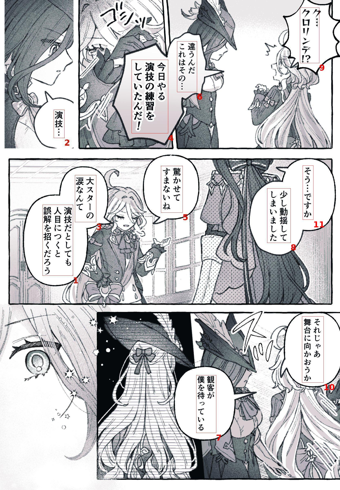

#### Features
- 基于paddle-ocr的文本位置检测
- 基于manga-ocr的日语文本识别
- 接百度翻译API
#### Usage
创建temp文件夹，放入test.jpg，运行
```
python main.py -d -t -g
```
原图：

识别后的测试图如下：

文字识别结果+翻译+提示词：
[点击这里查看 output.txt 文件](./static/output.txt)